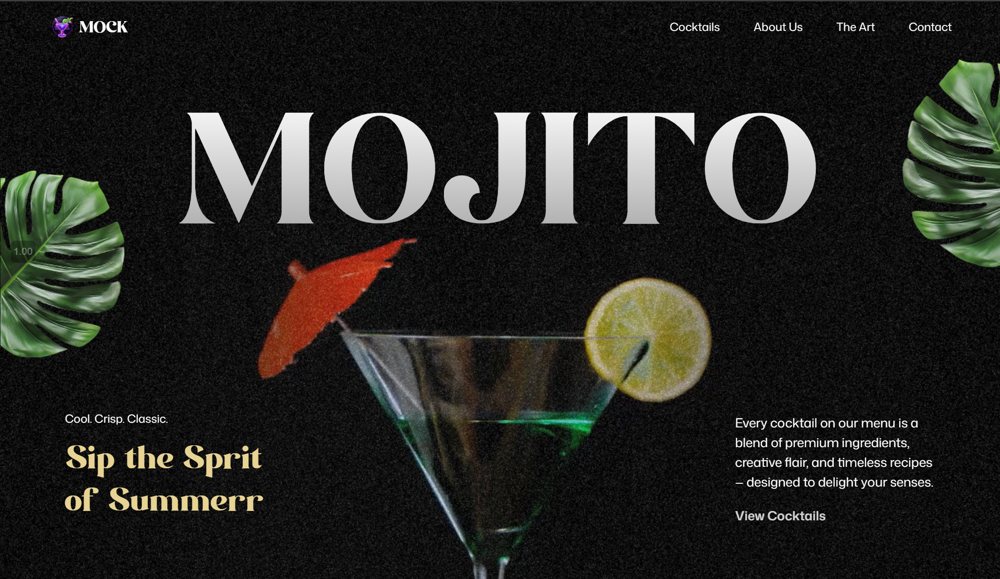

# 🍹 Mocktail — A Refreshing Digital Bar Experience

Welcome to **Mocktail**, a sleek, animated website built to showcase handcrafted mocktail recipes with an elegant, modern, and motion-driven design. Inspired by premium web experiences and Awwwards-style aesthetics, this project is built with **React**, **GSAP**, and **Tailwind CSS**.



---

## 🌟 Features

- 🎥 Smooth scroll-driven **GSAP animations**
- 💻 Responsive layout (Mobile-first design)
- 🎬 Scroll-triggered **video pinning** and animation
- 🧠 SplitText title animation for engaging intro
- 🖼️ Styled with **Tailwind CSS 4**
- ⚡ Built with **Vite** for ultra-fast performance

---

## 📸 Preview

> [🔗 Live Demo](https://mocktail-ten.vercel.app/)

---

## 🛠️ Tech Stack

| Tool              | Purpose                        |
|-------------------|--------------------------------|
| **React**         | UI Library                     |
| **Tailwind CSS**  | Styling Framework              |
| **GSAP + ScrollTrigger** | Animations & Interactions   |
| **Vite**          | Frontend Build Tool            |
| **@gsap/react**   | GSAP integration with React    |
| **react-responsive** | Mobile responsiveness       |

---

## 📂 Folder Structure

```bash
├── public/
│   ├── images/
│   └── videos/
├── src/
│   ├── components/
│   │   ├── About.jsx
│   │   ├── Art.jsx
│   │   ├── Hero.jsx
│   │   ├── Footer.jsx
│   │   ├── Navbar.jsx
│   │   ├── Menu.jsx
│   │   └── Cocktails.jsx
│   ├── constants/
│   │   └── index.js
│   ├── App.jsx
│   └── main.jsx
├── tailwind.config.js
├── vite.config.js
└── package.json
